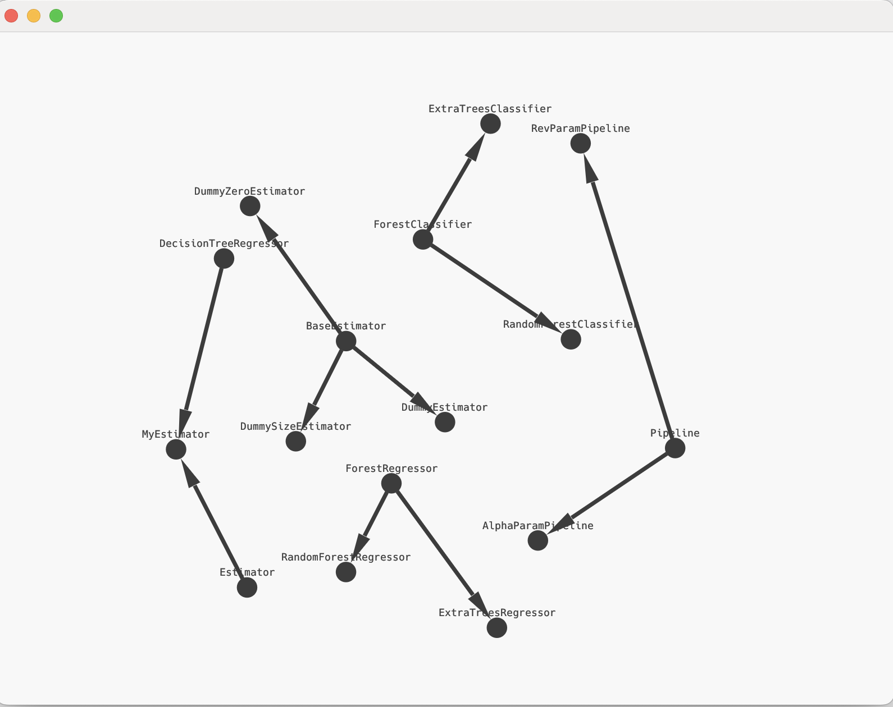
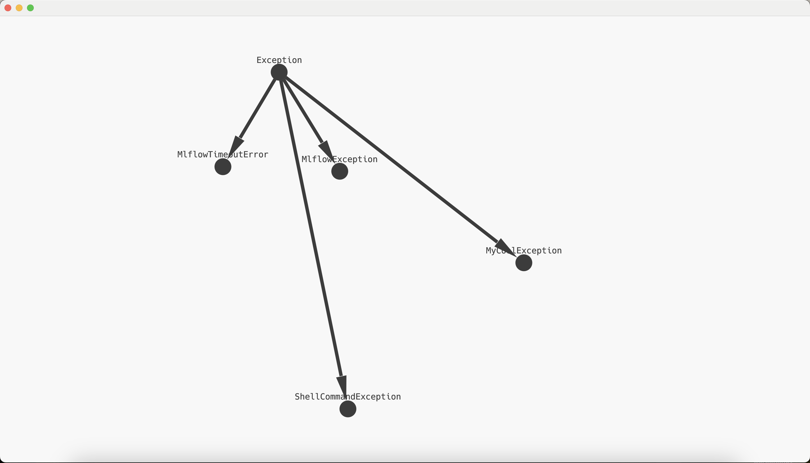

# OOP Viewer :spider_web:

A CLI tool to produce interactive visualisations of OOP inheritance in Python projects.

## Examples

### Scikit-Learn - Ensemble Module


### FastAPI - Everything


### MLFlow - Classes Referencing `Exception`


## Usage

### On an individual file

```bash
oop_viewer examples/dummy_python.py
```

### On a module

```bash
oop_viewer examples
```

### Including a specified class

```bash
oop_viewer examples OtherChildClass
```

## Backlog
- [ ] Multiple Inheritance
- [ ] Colour nodes based on file
- [ ] Disambiguiting overlapping nodes
- [X] Allowing for passing of class across module

## How to build

Currently building is done manually until precompiled binaries are distributed.

To build the tool you'll need to install [Rust](https://github.com/rust-lang/rust) and [Cargo](https://github.com/rust-lang/cargo). The [Rust Foundation Book](https://doc.rust-lang.org/book/ch01-01-installation.html) has really good documentation for how to install both. Once these are installed, clone the repo and do the following:

1. Build the binary
```bash
cargo build --release
```

2. Install the binary globally
```bash
cargo install --path .
```

3. Add `~/.cargo/bin` to `$PATH`
```bash
export PATH="$HOME/.cargo/bin:$PATH"
```
